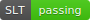
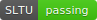
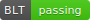
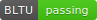

# Hardware-Software Co-Design with RISC-V & FPGA

A complete RISC-V processor implementation on FPGA with interrupt support, memory-mapped peripherals, HDMI output, and comprehensive testing infrastructure. This project implements a custom RISC-V processor (RV32I base ISA) with:

- **Two-stage CPU architecture** (Program Counter + Datapath/Operations)
- **Interrupt support** via PLIC (Platform-Level Interrupt Controller) and CLINT (Core-Local Interruptor)
- **Memory-mapped peripherals**: LEDs, switches, timers, HDMI controller
- **HDMI video output** with AXI bus interface
- **Automated testing** for all RV32I instructions with mutant verification
- **GHDL simulation pipeline** — run and render Space Invaders without Vivado
- **Dual compilation modes**: bare-metal assembly and C with libfemto

## Space Invaders — GHDL Simulation

Space Invaders running on the custom RISC-V CPU, rendered from GHDL hardware simulation at 320×240 (25 frames, 50ms simulated time):


The full pipeline: `C source → RISC-V .mem binary → GHDL simulation → VRAM write log → PNG frames → animated GIF`

```bash
# 1. Compile Space Invaders for simulation (320x240, ENV_SIM)
make compile_invaders_sim

# 2. Run GHDL simulation (captures ~25 game frames)
bash scripts/run_sim.sh

# 3. Render frames and animated GIF
python3 scripts/render_frames.py
# Output: frames/frame_XXXX.png + frames/invaders.gif
```

## Prerequisites

- **Xilinx Zynq-7000 (xc7z010clg400-1)** FPGA
- **GNU Make**
- **RISC-V GCC Toolchain**: `riscv32-unknown-elf-*` (with `-march=rv32i -mabi=ilp32` support)
- **Xilinx Vivado 2019.1** (for synthesis, FPGA programming, and xsim simulation)
  - Must source: `/bigsoft/Xilinx/Vivado/2019.1/settings64.sh`
- **GHDL** (for Vivado-free simulation and autotests on macOS/Linux)
  - Install: `brew install ghdl`

## Build Commands

**There is no default build target** — `PROG=<name>` is always required.

```bash
# Compile a program to .mem (bare-metal assembly)
make compile PROG=add

# Compile a C program (requires libfemto)
make compile PROG=invaders LIB=libfemto

# Run simulation with GUI (Vivado waveform viewer)
make simulation PROG=add

# Run simulation from CLI with custom duration
make simulation_cli PROG=add TIME=5000ns   # default TIME=10000ns

# Synthesize to bitstream (no FPGA programming)
make synthesis PROG=compteur

# Full flow: compile → synthesize → program FPGA via JTAG
make fpga PROG=chenillard_rotation

# Run all RV32I instruction autotests (Vivado)
make autotest

# Run all RV32I instruction autotests (GHDL, no Vivado required)
bash scripts/run_autotest.sh

# Cleanup
make clean        # remove build artifacts
make realclean    # full cleanup including synthesis outputs
make help         # show available targets
```

### Makefile Variables

| Variable | Default | Description |
|----------|---------|-------------|
| `PROG` | *(required)* | Program name |
| `LIB` | *(none)* | `libfemto` for C programs |
| `TIME` | `10000ns` | Simulation duration |
| `TOP` | `PROC` | Top-level entity |

## Architecture

### System Hierarchy

```
PROC (vhd/PROC.vhd)
├── CPU (vhd/CPU.vhd)
│   ├── CPU_PC  — 37-state FSM: fetch / decode / execute control
│   ├── CPU_PO  — ALU, register file, memory operations
│   ├── CPU_CND — Branch condition evaluator
│   └── CPU_CSR — CSR manager (mstatus, mepc, mcause, mtvec…)
├── RAM32       — 32KB on-chip program memory
├── PROC_bus    — Memory-mapped peripheral interconnect
└── Peripherals
    ├── IP_PLIC   — Platform-Level Interrupt Controller
    ├── IP_CLINT  — Core-Local Interruptor (timer/software interrupts)
    ├── IP_LED    — LEDs, switches, debug pout port (x31 writes)
    ├── IP_PIN    — Push buttons
    ├── IP_Timer  — Programmable timer
    └── HDMI subsystem (vhd/hdmi/) — AXI master + video encoder + TMDS
```

### Memory Map

| Range | Description |
|-------|-------------|
| `0x0000_1000` | 32KB on-chip RAM |
| `0x3000_0000` | Memory-mapped peripherals (LED, PLIC, CLINT, Timer…) |
| `0x8000_0000` | 256MB external DDR3 (accessed via AXI from HDMI) |

### Type Conventions (`vhd/PKG.vhd`)

All signals use strongly-typed VHDL enums (e.g., `ALU_op_type`, `LOGICAL_op_type`, `SHIFT_op_type`). When adding new operations, extend the type in `PKG.vhd` first.

## Autotest Format

Each `program/autotest/*.s` test uses comment directives:

```asm
# TAG = add
    .text
    lui x1, 0x12345
    add x2, x1, x0

    # max_cycle 50
    # pout_start
    # 00000000
    # 12345000
    # pout_end
```

- **TAG**: Instruction category (matched in `program/sequence_tag`)
- **pout_start/pout_end**: Expected values compared against `x31` debug writes
- **max_cycle**: Simulation timeout in cycles

## GHDL Autotests (49/49 passing)

Run all RV32I instruction tests without Vivado using GHDL:

```bash
bash scripts/run_autotest.sh          # run all tests
bash scripts/run_autotest.sh add      # run single test
```

All 49 tests pass (arithmetic, logical, shifts, branches, loads/stores, CSR, interrupts).

## Adding a New Instruction

1. Add any new control signal types to `vhd/PKG.vhd`
2. Add decode/control logic to `vhd/CPU_PC.vhd` (FSM states)
3. Add datapath operation to `vhd/CPU_PO.vhd` if needed
4. Write a test in `program/autotest/<insn>.s` following the autotest format above

## Demo Programs

```bash
make fpga PROG=chenillard_minimaliste          # LED chaser
make fpga PROG=chenillard_rotation             # LED rotation pattern
make fpga PROG=compteur                        # Counter display
make fpga PROG=invaders LIB=libfemto           # Space Invaders (requires HDMI display)
```

## Full RV32I Base ISA

- **Arithmetic**: ADD, ADDI, SUB
- **Logical**: AND, ANDI, OR, ORI, XOR, XORI
- **Shifts**: SLL, SLLI, SRL, SRLI, SRA, SRAI
- **Comparison**: SLT, SLTI, SLTU, SLTIU
- **Branches**: BEQ, BNE, BLT, BLTU, BGE, BGEU
- **Jumps**: JAL, JALR
- **Loads**: LW, LH, LHU, LB, LBU
- **Stores**: SW, SH, SB
- **Upper Immediate**: LUI, AUIPC
- **CSR**: CSRRW, CSRRS, CSRRC, CSRRWI, CSRRSI, CSRRCI
- **Interrupts**: MRET (machine return)

## Instruction Status

Badges are generated locally by `bash scripts/run_autotest.sh` and committed to `badges/`.

### Métadonnées


### Arithmetiques

  

### Basiques

 

### Divers


### Logiques

     

### Décalages

     

### Sets

   

### Branchements

     

### Sauts

 

### Loads

    

### Stores

  

### Interruptions

       

## Travail evalué en présence des enseignants

   
